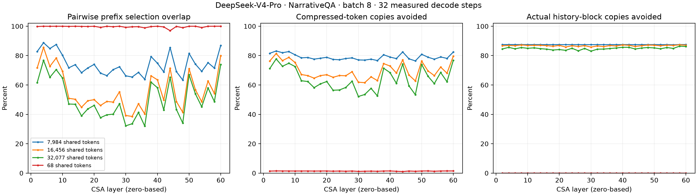
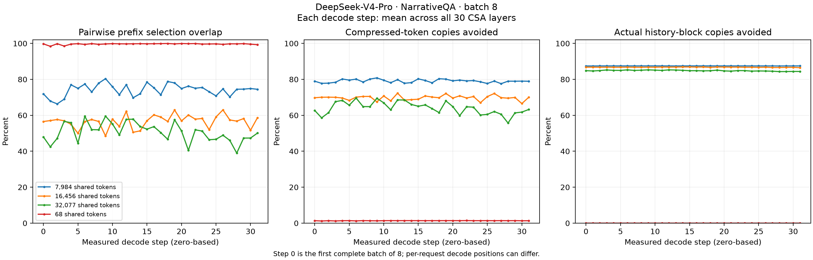

<!--
SPDX-FileCopyrightText: Copyright (c) 2026 NVIDIA CORPORATION & AFFILIATES. All rights reserved.
SPDX-License-Identifier: Apache-2.0
-->

**Conclusion: selections from different requests overlap substantially within the
same batch and layer. Measurements on these shared long prefixes support a global
KV device cache shared across requests within each pool. Selections and logical
page tables remain specific to each request.**

**Measured results.** The full DeepSeek-V4-Pro checkpoint was run on 8 × B200 with
TP=8, EP=8, and attention DP disabled. The workload uses
[LongBench NarrativeQA](https://github.com/THUDM/LongBench/blob/main/LongBench/task.md),
grouped by exact document equality. Eight benchmark records were submitted in
one generation call, and the actual attention batches were verified to contain
all eight requests simultaneously. The three documents were used in full without
truncation; the shared prefix precedes the different questions. Each case captured
30 CSA layers across 32 consecutive complete decode batches. HCA layers do not use
this top-k selector and were excluded.

| Workload, batch=8 | Shared prefix, original tokens | Prefix token overlap | Prefix token Jaccard | Compressed-token copy reduction | History-block copy reduction at actual cache granularity |
| --- | ---: | ---: | ---: | ---: | ---: |
| Shared document, 8K | 7,984 | **74.15%** | 60.19% | 79.07% | **87.47%** |
| Shared document, 16K | 16,456 | **56.68%** | 41.85% | 69.76% | **86.77%** |
| Shared document, 32K | 32,077 | **50.58%** | 36.28% | 64.05% | **84.89%** |
| Different documents, sharing only a short system prompt/preamble | 68 | 99.66% | 89.32% | 1.35% | **0.00%** |
| Identical input requests, control | 7,994 | 80.61% | 68.94% | 81.30% | 87.48% |

Overlap and Jaccard are averaged over the 28 request pairs in each layer and step,
then over the 30 × 32 observations. Pairs with an empty overlap denominator are
excluded from that mean. Copy reduction percentages are weighted by the number of
copies in each observation. The eight benchmark records in the 32K group contain
seven distinct questions: dataset rows 8 and 110 have identical prompts. Removing
the duplicate from the same measured batch's trace gives a seven-request subset
with **50.38%** token overlap, **60.80%** token copy reduction, and **82.74%** block
copy reduction at actual cache granularity. The conclusion does not depend on
this duplicate pair. This subset is a storage accounting analysis; inference was
not rerun at B=7.

**Variation across decode steps.** The plot below uses the same workloads and metrics,
with measured decode step (0–31) on the x-axis. Each point computes the metric within
each layer at that step, then averages equally across all 30 CSA layers. Overlap
first averages the 28 request pairs within each layer; both copy reduction metrics
deduplicate selections across the entire eight-request batch within each layer.
Step 0 is the first complete decode batch containing all eight requests; individual
requests may be at different decode positions.

**Metric definitions and block granularity.** Each CSA layer selects 1,024 compressed
tokens, with a compression ratio of 4. Let request i's selection be `S_i`, the shared
compressed prefix be `[0, P)`, and `A_i = S_i ∩ [0, P)`. The table's overlap metric is
`|A_i ∩ A_j| / min(|A_i|, |A_j|)`; Jaccard uses `|A_i ∪ A_j|` as the denominator.
The number of token copies avoided is `Σ|A_i| − |∪A_i|`, divided by `Σ|S_i|` to obtain
the overall reduction. Matching ordinals in different requests' private suffixes
are not treated as the same KV data.

The actual setting is `tokens_per_block=128`, so each CSA block contains 32 compressed
tokens. Block accounting includes only complete history blocks below the watermark
and deduplicates using actual page IDs from `compress_block_tables[4]` in the traces.
Each layer is evaluated separately, without merging identities across layers or
pools. In all three shared-document groups, **100%** of the complete shared-prefix
pages were physically shared. The average number of history-block copies per
batch/layer falls from approximately **495 → 62, 967 → 128, and 1,629 → 246**,
respectively. The theoretical maximum copy reduction at B=8 is 87.5%.

Block overlap is higher than token overlap partly because of block granularity
itself: a single request touches, on average, **99.79%, 94.43%, and 81.44%** of the
shared-prefix blocks in the three document groups. High block sharing therefore
does not imply sparse block access within an individual request. Token intersections
also exceed the conditional expectation for uniform random selection at the same
selection density: the measured mean intersections are approximately **1.45×, 2.30×,
and 3.99×** that expectation, respectively. This is a density control, not a
statistical significance test.

**System-prompt overlap is high, but the absolute benefit of a short prefix is small.**
The system message itself has only 20 tokens, corresponding to 5 complete compressed
tokens. In the different-document control, each request selects an average of 4.78
of them, and pairwise overlap within the system portion is **99.90%**. However, this
portion accounts for only **0.47%** of all selected tokens; even deduplicating at
compressed-token granularity reduces total copies by only **0.41%**. Including the
common benchmark instructions brings the shared prefix to 68 tokens, still less
than one 128-token block. There is therefore no complete history block to share at
the current block granularity. This finding applies to the short system prompt used
here; block-level benefits for a long system prompt must be calculated from its
actual shared-prefix length.

**Recommendations for the cache design.**

- Maintain a map, free list, and LRU shared across requests within each device-cache
  pool. Use `(host slot id, buffer index)` to identify a single layer's KV buffer.
  A shared prefix page should resolve to the same cache entry through each request's
  own page table.
- Generate selections and maintain logical ordinals/page tables independently for
  each request. Different questions and decode positions produce different selections;
  overlap does not justify directly reusing another request's selection.
- Preserve the canonical page identities and lifetimes established by prefix reuse
  in the host tier. If identical text is stored in different host slots, a key based
  on provenance will not merge those slots by itself. This experiment primed each
  prompt individually before measuring with shared physical pages. Page merging
  during concurrent cold prefill was not measured.
- Continue to reserve capacity for the design's worst case,
  `max_batch_size × num_selected_blocks`. The measured 84.9%–87.5% deduplication
  benefit belongs to this workload and cannot justify reducing the capacity
  guarantee required for correctness.

**Scope and validation.** All captured batches are pure decode with one query per
request. Request IDs and positions match across all CSA layers, positions advance
consecutively at each step, top-k is exactly 1,024, and indices are unique and within
the causal boundary. The fixed offset of 6 between API and backend IDs comes from
the allocation rules of this run's single frontend and was checked for every batch.
Excerpts from the runtime allocation code are preserved in
[request_id_allocation.txt](artifacts/request_id_allocation.txt). The saved data
contains 150 raw layer traces, representing 4,800 layer/batch observations and
38,400 request selections.

Requests differ in decode progress by 0–7 tokens in the first complete B=8 batch.
Considering only that first complete batch, token overlap in the three long-prefix
groups is still **71.94%, 56.55%, and 47.96%**, and block copy reduction at actual
cache granularity is still **87.45%, 86.79%, and 84.89%**. To maintain the batch,
generation uses greedy decoding, a fixed 64-token output length, and
`ignore_eos=True`; the first 32 complete batches are captured. Short answers are
therefore followed by forced continuation. These data describe that generation
setting and do not represent accuracy with natural answer lengths or the
distribution of all production traffic.

The identical-input control also has differences in decode progress, so its
selection overlap in the table should not be expected to reach 100%. Restricting
the comparison further to the same batch, layer, and query position, with identical
generated token histories, yields 1,890 pairs. Their full selections have a mean
overlap of **97.08%**, a minimum of **91.99%**, and 63 exactly matching sets. Thus,
this run does not guarantee bitwise-identical selections; the numerical source of
the remaining differences was not isolated. See
[identical_query_control.json](artifacts/results/identical_query_control.json).

This experiment measures deduplication of the selected working set within one
batch/layer. **It did not implement or measure host offload, global LRU hit rates,
H2D traffic, or end-to-end speedups.** Actual long-term cache benefits also depend
on capacity, prior residency, and scheduling. The model is the full Pro checkpoint.
The runtime uses the recorded compatible wheel, which is 21 commits older than the
worktree base. The indexer baseline was verified to match the worktree before adding
a read-only trace hook. The main KV cache uses FP8; indexer K uses the runtime's
default FP4, with exact top-k selection. Full version details and changes to the
observation code made during execution are documented in
[provenance.json](artifacts/provenance.json); configuration is recorded in
[run_config.json](artifacts/results/run_config.json).
