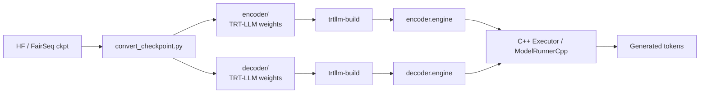
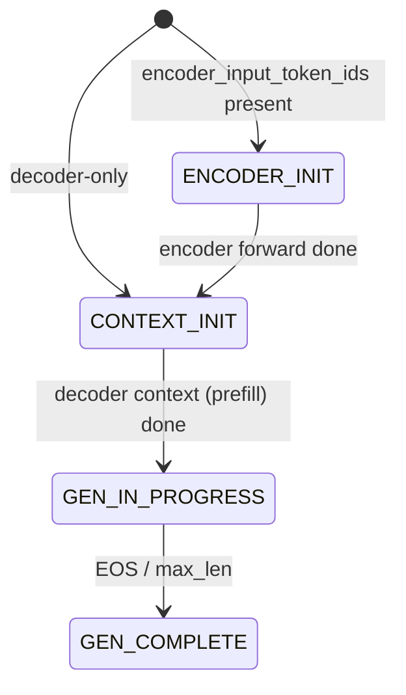
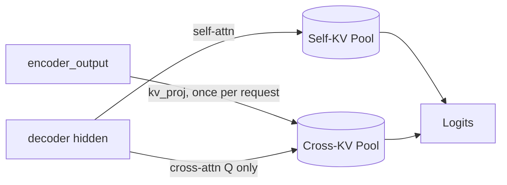
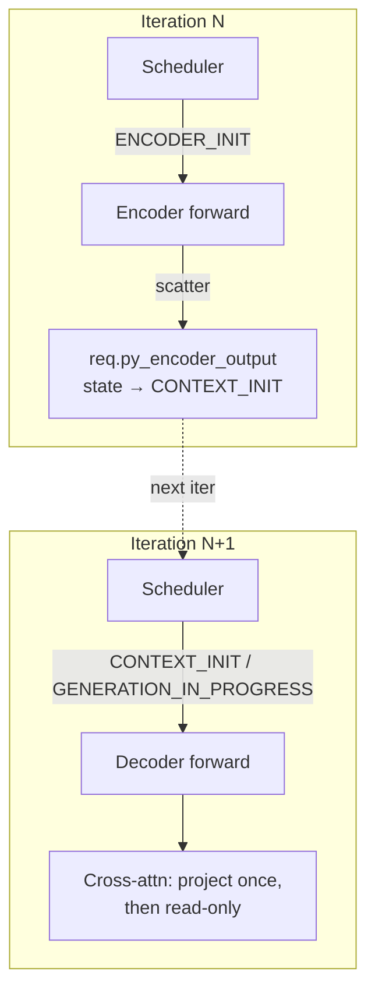

# Porting Encoder-Decoder Models from Legacy TRT to the PyTorch Path

> Talk track / slide outline. Goal: present the porting plan and collect feedback.
> Companion deep-dive docs: `legacy_enc_dec_architecture.md`, `encoder_decoder_porting_guide.md`.

---

## 1. What Is an Encoder-Decoder Model?

**Two generative model families:**

| Family                        | Examples                                    | What it does                                                             |
| ----------------------------- | ------------------------------------------- | ------------------------------------------------------------------------ |
| Decoder-only                  | GPT, LLaMA, Qwen, Mistral, DeepSeek         | Causal LM. Continues a single token stream.                              |
| **Encoder-decoder (seq2seq)** | T5, Flan-T5, mT5, BART, mBART, NMT, Whisper | Two stacks: bidirectional encoder + causal decoder with cross-attention. |

**Decoder-only:** the model receives a single input sequence and continues it autoregressively, one token at a time. Every token attends to itself and to past tokens (causal self-attention). The prompt and the generation are part of the same continuous stream.

**Encoder-decoder (seq2seq):** the model treats input and output as two separate sequences.

- The **source** sequence — for example an English sentence to translate, an audio clip to transcribe, or a long document to summarize — is fed into the **encoder**, which produces a fixed set of hidden states. The encoder is bidirectional: every source token attends to every other source token.
- The **target** sequence is generated autoregressively by the **decoder**. Each decoder layer has two attention sublayers:
  - **Self-attention** over previously generated target tokens (causal, like a decoder-only model).
  - **Cross-attention** that looks back at the encoder's hidden states, so every generated token is grounded in the source.

---

## 2. Current Workflow on the TRT Path

**Three offline + runtime stages:**

1. **Convert** — `convert_checkpoint.py` reads HF / FairSeq weights, splits for TP / PP, writes **two** weight directories: `encoder/` and `decoder/`.
2. **Build** — `trtllm-build` runs **twice**, producing two TRT engines.
3. **Run** — `Executor` (or `ModelRunnerCpp`) loads **both** engines, takes a single request with `encoder_input_token_ids`, returns generated tokens.

**Two production entry points:**

- `ModelRunnerCpp` — Python wrapper over the C++ `Executor::Impl`. IFB, paged KV, used by `trtllm-serve` and the Triton backend.
- `EncDecModelRunner` — pure-Python fallback. Static batching only. Mostly for debugging.

---

## 3. Supported Features on the TRT Path

| Axis                      | Coverage                                                                                                                                                                            |
| ------------------------- | ----------------------------------------------------------------------------------------------------------------------------------------------------------------------------------- |
| **Model families**        | T5, T5v1.1, Flan-T5, mT5, ByT5, BART, mBART, FairSeq NMT, Whisper                                                                                                                   |
| **Precisions**            | FP32, FP16, BF16, FP8 PTQ via ModelOpt (BART + T5 family)                                                                                                                           |
| **Parallelism**           | TP, PP, and TP × PP hybrid (PP encoder side: Python runner only — C++ executor and Triton backend reject PP encoder)                                                                |
| **Attention**             | `gptAttentionPlugin` (wraps FMHA+MMHA) for self + cross; `bertAttentionPlugin` (wraps FMHA) for encoder; FMHA for BART encoder; T5 disables FMHA (relative attention bias) |
| **KV cache**              | Paged KV with **dual pools**: self-KV + cross-KV; sized by `crossKvCacheFraction`; cross-KV is one-shot per request                                                                 |
| **Inflight Batching**     | Supported via `TrtGptModelInflightBatching` (decoder side)                                                                                                                          |
| **LoRA**                  | Supported on BART (target modules incl. `cross_attn_q`, `cross_attn_v`)                                                                                                             |
| **Beam search**           | Supported, configured at build time via `--max_beam_width`                                                                                                                          |
| **Disaggregated serving** | **Not supported** for enc-dec on either path                                                                                                                                        |

---

## 4. How the Scheduler Works on the TRT Path

**Core invariant:** encoder and decoder requests are **never** mixed in the same micro-batch.

**Two model wrappers, two schedulers, two CUDA streams, one event per iteration:**

1. `**TrtEncoderModel`** owns encoder engine + its own `CapacityScheduler` + `MicroBatchScheduler`. Scheduler is **gated to `[ENCODER_INIT, CONTEXT_INIT)`** — only encoder-phase requests are visible.
2. `**TrtGptModelInflightBatching**` owns decoder engine. Its scheduler only admits requests at `CONTEXT_INIT` or later.
3. `**Executor::Impl::forwardAsync**` drives both per iteration:
  - Run encoder → record CUDA event → decoder stream waits on event → run decoder.
  - Encoder writes `encoder_output` back onto each `LlmRequest` and flips state to `CONTEXT_INIT`.
  - Decoder picks up newly-promoted requests on the **same** iteration.

**Why two streams + an event:** the encoder/decoder overlap is what gives the legacy path its steady-state throughput. Different requests can have one in encoder and another in decoder concurrently.

---

## 5. Porting Plan: Goal

**Bring text encoder-decoder models (T5, BART, mBART) to the PyTorch path with parity to the legacy C++ production path.**

Two parity axes:

1. **Feature parity** — support the same feature surface the legacy TRT path ships today (Section 3): precisions (FP16/BF16, FP8 PTQ for T5 + BART), TP, PP, `TRTLLM` attention backend, paged dual KV cache (self + cross), IFB. Out-of-scope items called out below.
2. **End-to-end performance parity** — match throughput / TTFT / TPOT / peak memory on standard production workloads.

**Scope:**

- **In scope:** T5, BART, mBART (text path).
- **Out of scope (stage-1):** BART with LoRA, Beam search > 1, Whisper (mel features).
- **Architectural choice:** **V2-only** — `use_kv_cache_manager_v2=True` is the supported runtime contract for enc-dec.

---

## 6. Dual KV Cache: Self-KV vs. Cross-KV

**Why two pools?**

| Pool         | What it stores                                        | Lifecycle                                                           | Sized by                                         |
| ------------ | ----------------------------------------------------- | ------------------------------------------------------------------- | ------------------------------------------------ |
| **Self-KV**  | K/V of decoded tokens (self-attention)                | Grows one entry per generated token                                 | Decoder-side KV head count                       |
| **Cross-KV** | K/V projected from `encoder_output` (cross-attention) | Computed **once** on the first decoder context step, then read-only | Encoder-side KV head count, `encoder_output_len` |

**The one-shot trick:**

- First decoder step: `kv_proj(encoder_hidden_states)` → write to cross-KV pool. Cost ≈ 1 GEMM per layer.
- Every subsequent decoder step: just **read** the cross-KV pool. No re-projection.

**Memory split:** `cross_kv_cache_fraction` knob (default 0.5) governs how the free memory is partitioned between the two pools.

---

## 7. V1 vs. V2 KV Cache Manager

**Quick orientation:**

| Layer                                                                          | What it is                                         | Used by                                                                 |
| ------------------------------------------------------------------------------ | -------------------------------------------------- | ----------------------------------------------------------------------- |
| C++ `kv_cache_manager::KVCacheManager` (supports `CacheType::{kSELF, kCROSS}`) | C++ engine; dual-pool capable                      | **Legacy TRT path** (directly), and **PyTorch V1** (via Python binding) |
| PyTorch **V1** `KVCacheManager`                                                | Thin Python wrapper around the C++ class above     | Default for decoder-only PyTorch models                                 |
| PyTorch **V2** `KVCacheManagerV2`                                              | Pure-Python re-implementation — separate code path | Opt-in path                                                             |

**Both paths are structurally enc-dec-capable** — neither is missing core logic; the difference is where the wiring already exists. This plan recommends **V2**. Objective trade-off:

| Axis                                               | V1 path                                                                                                                                          | V2 path                                                                                                                                                                                                                            |
| -------------------------------------------------- | ------------------------------------------------------------------------------------------------------------------------------------------------ | ---------------------------------------------------------------------------------------------------------------------------------------------------------------------------------------------------------------------------------- |
| **Underlying engine maturity**                     | ✅ Same C++ engine legacy enc-dec uses today                                                                                          | ⚠️ Newer Python re-implementation; smaller production footprint                                                                                                                                                                    |
| **Decoder-only feature coverage**                  | ✅ Full V1 feature surface, including beam>1, KV cache events, KV connector manager (disagg), STAR context parallelism                            | ✅ TP / PP / chunked context / KV block reuse / quantized KV (FP8 + NVFP4) all work. ⚠️ Hard-asserts off: beam>1, KV cache events, KV connector manager, STAR context parallelism, two-model spec-dec with separate draft KV budget |
| **Enc-dec wiring already done on the Python side** | ⚠️ Needs to be added: second `KVCacheManagerCpp` instance, `cross_kv_cache_fraction` plumbing, `kENCODER_INIT` passed to `BindCapacityScheduler` | ✅ Already wired end-to-end (`cross_kv_cache_manager`, `cross_kv_cache_fraction`, encoder admission)                                                                                                                                |

**Why the current plan picks V2:**

- V2 is the long-term direction — it's the newer manager and is expected to replace V1 over time as decoder-only gaps close. V2's enc-dec wiring is already exercised end-to-end on the Python side.
- Beam>1 is the main V2 gap; the stage-1 plan ships beam=1 anyway, which sidesteps it.

---

## 8. Attention Support Across SM Versions

**Bridge — legacy plugins → PyTorch attention backend.** Legacy uses `gptAttentionPlugin` (decoder self + cross, via `do_cross_attention`) and `bertAttentionPlugin` (encoder self). PyTorch routes all attention through one Python backend selected by `attn_backend`; production is `TRTLLM`. **Both wrap the same C++ class**, `tensorrt_llm::common::op::AttentionOp`, which owns MMHA / XQA (decode) and context-FMHA (prefill + encoder self). Legacy wraps it as TRT plugins; PyTorch wraps it as `torch.ops.trtllm.attention` (the `void attention(...)` C++ op + nanobind). On Blackwell, the PyTorch backend additionally dispatches into a newer kernel family, `trtllm_gen`, exposed via `torch.ops.trtllm.qkv_preprocessing`.

So **kernel code is shared; what differs is the wrapper.** Cross-attention on the PyTorch side is an *exposure* problem, not a kernel problem — legacy already exercises the cross-attn code paths via `do_cross_attention`; the PyTorch wrapper just doesn't expose the cross-attn arguments yet.

| Sub-path                             | Hardware                   | Cross-attn exposure today                                                                                       | Step   | Work to unblock                                                                                                                       |
| ------------------------------------ | -------------------------- | --------------------------------------------------------------------------------------------------------------- | ------ | ------------------------------------------------------------------------------------------------------------------------------------- |
| `trtllm_gen` (Blackwell new)         | SM100+ (Blackwell)         | ✅ Python args (`cross_kv_input`, `encoder_seq_lens`, `cross_attention`) and `qkv_preprocessing` binding already there | **5α** | Drop `is_cross` assert + thread args through `trtllm_gen.is_supported` and `qkv_preprocessing` call sites. **Python-only**, no C++ change. |
| Legacy `attentionOp` (pre-Blackwell) | SM80–SM90 (Ampere, Hopper) | ❌ no cross-attn parameters in `void attention(...)` wrapper; C++ has the fields but not bound                    | **5β** | Extend `void attention(...)` C++ wrapper + nanobind binding; wire pre-Blackwell path. Cross-language (thop + nanobind), **no new kernels**.   |

After 5α + 5β, `ModelConfig.attn_backend == "TRTLLM"` selects the production backend on **every** architecture. Blackwell still prefers `trtllm_gen`; other archs fall through to the legacy path.

---

## 9. PyTorch-Path Scheduler

**Reuse, don't reinvent.** No new `TrtEncoderModel` / `TrtGptModelInflightBatching` peer classes. The existing `PyTorchModelEngine` and `KVCacheV2Scheduler` are extended.

**State machine: same as legacy** (`ENCODER_INIT → CONTEXT_INIT → GENERATION_IN_PROGRESS → GENERATION_COMPLETE`).

**Invariant:** encoder and decoder requests **never share one micro-batch**. The executor splits the scheduler's `context_requests` bucket into encoder vs. decoder-context subsets so each forward pass sees one type only.

**Per-request flow (next-iteration dispatch):**

1. **Iteration N — encoder phase.** Scheduler admits `ENCODER_INIT` (admission reserves cross-KV pool with `encoder_output_len`). Encoder forward → scatter packed hidden states into `req.py_encoder_output` → state → `CONTEXT_INIT`.
2. **Iteration N+1 — decoder phase.** Scheduler admits `CONTEXT_INIT` / `GENERATION_IN_PROGRESS`. Decoder forward runs (normal IFB step + cross-attention; first context step projects cross-KV, later steps read it).
3. **Termination** releases **both** self-KV and cross-KV blocks.

- **Main gap vs. legacy:**
  - **single stream vs. two streams.** Two streams enable **inter-iteration overlap** (iter M+1 encoder runs concurrently with iter M decoder); a single stream does not. Within one iteration, encoder→decoder is serialized by the event in both cases — no within-iter overlap.

---

## 10. TP and PP Support

**Tensor Parallelism (TP):**

- Works out of the box via existing `Attention` sharding in `_torch/modules/attention.py`.
- Both encoder self-attention and decoder self-attention shard along `num_heads`.
- **Caveat (T5-family only):** relative attention bias table is split along `num_heads` ⇒ `num_heads` must be divisible by `tp_size`.

**Pipeline Parallelism (PP):**

- **Stage-1: PP=1 only.** Reject `pp_size > 1` on enc-dec models.
- This matches the legacy C++ executor (`TrtEncoderModel` constructor asserts `!isPipelineParallel()`) — PP encoder is also unsupported there.

---

## 11. LoRA Support

**Status on the legacy path:**

- BART: supported. Target modules can include `attn_q`, `attn_v`, `**cross_attn_q`, `cross_attn_v`** (cross-attention LoRA is the seq2seq-specific bit).
- T5 family: not officially documented in the example.

**Plan for the PyTorch path:**

- **Stage-1: out of scope.** The stage-1 milestone targets correctness baseline on T5-base / BART-base **without LoRA**.
- **Post-stage-1:** wire LoRA on top of `CrossAttention`. The PyTorch LoRA infrastructure already exists for self-attention; the work is naming the cross-attention LoRA target modules consistently (`cross_attn_q`, `cross_attn_v`) and ensuring the per-request LoRA dispatch reaches the cross-attention sublayer.
- **Working call:** no day-one blocker assumed; lands as a follow-up. If any internal customer is attached to BART+LoRA, useful input — affects post-stage-1 sequencing.

---

## 12. Beam Search

**Status on the legacy path:**

- Supported up to a configurable max width via `--max_beam_width` at engine build time.

**Plan for the PyTorch path:**

- **Stage-1: beam>1 out of scope.** Stage-1 ships **beam width = 1** (matches `KVCacheManagerV2` constraints today).
- This aligns with the `Performance Validation` baseline (beam=1) used for parity benchmarking.
- **Post-stage-1:** beam-search support on enc-dec depends on beam-search support landing in `KVCacheManagerV2` more broadly (not enc-dec-specific).
- Cross-KV pool design is already beam-friendly because cross-KV is **shared across beams** of the same request — no per-beam duplication needed.

**Working call:** no day-one blocker assumed; beam>1 lands as a follow-up gated on V2 beam support more broadly. Coupled to the V2 recommendation in §7 — if beam>1 turns out to be needed sooner, V2 vs. V1 would warrant revisiting.

---

## 13. Areas Flagged for Feedback

Working calls below are made — sharing them so the room can see where the trade-offs landed and push back if anything looks off. Feedback on anything else from earlier in the deck is also welcome.

**Scope items (working call: all three sit outside stage-1; no day-one blocker assumed):**

1. **BART with LoRA.** If any internal customer is attached, affects post-stage-1 sequencing.
2. **Beam search > 1.** Coupled to the V2 recommendation in §7 — not blocking on its own.
3. **Whisper (mel features).** Not currently planned to port at all. Customer pull would be the input that revisits the gap-G5 budget.

---

### Appendix: Where to read more

- `**legacy_enc_dec_architecture.md`** — file-by-file reference of the legacy C++ / TRT path. Read when changing legacy code.
- `**encoder_decoder_porting_guide.md**` — full porting plan with parity gaps, performance validation matrix, recommended implementation order, and per-step ETA.
- `**examples/models/core/enc_dec/README.md**` — user-facing build & run instructions for the legacy path.
